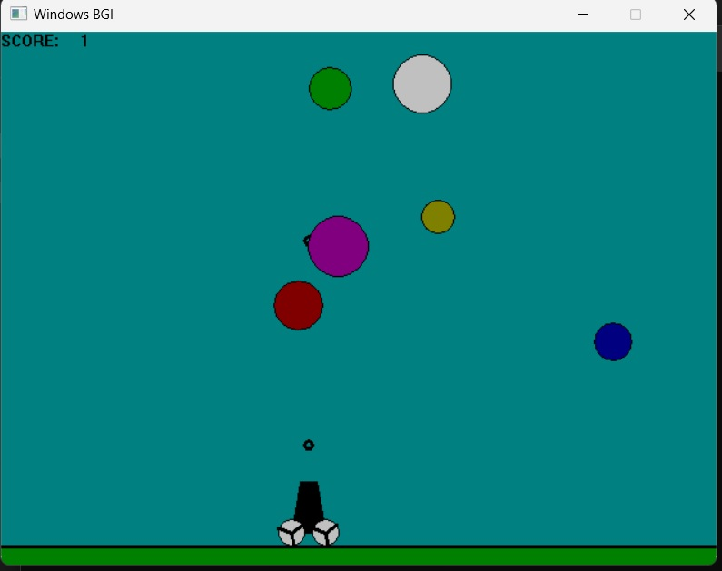

# Ball_Blast_Cannon_blitz
This Game Project is inspired by the original android game https://play.google.com/store/apps/details?id=com.nomonkeys.ballblast
This Project was an Assignment for my course 'Computer Graphics' in my College.

The project uses graphics.h, which is not a modern graphics library like OpenGL, but is required for the first part of the course.

You need to install graphics.h before you can run The program.
The Installation of graphics.h is different for each IDE.

